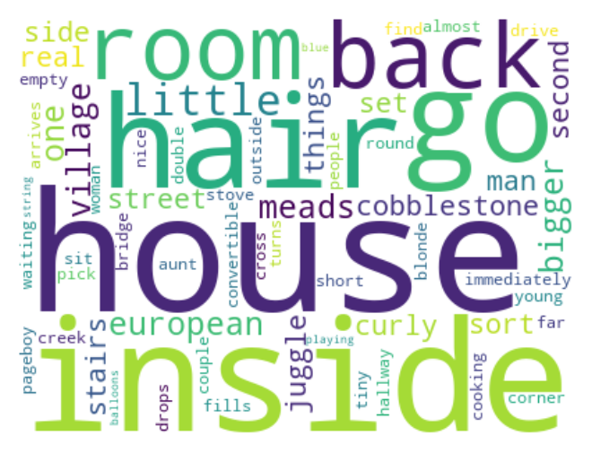
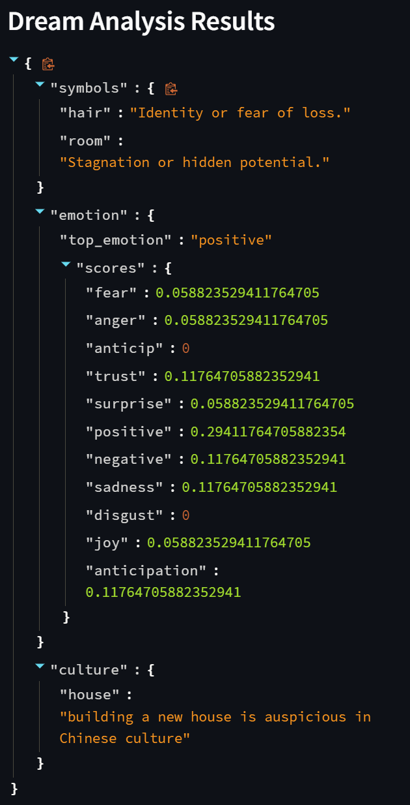
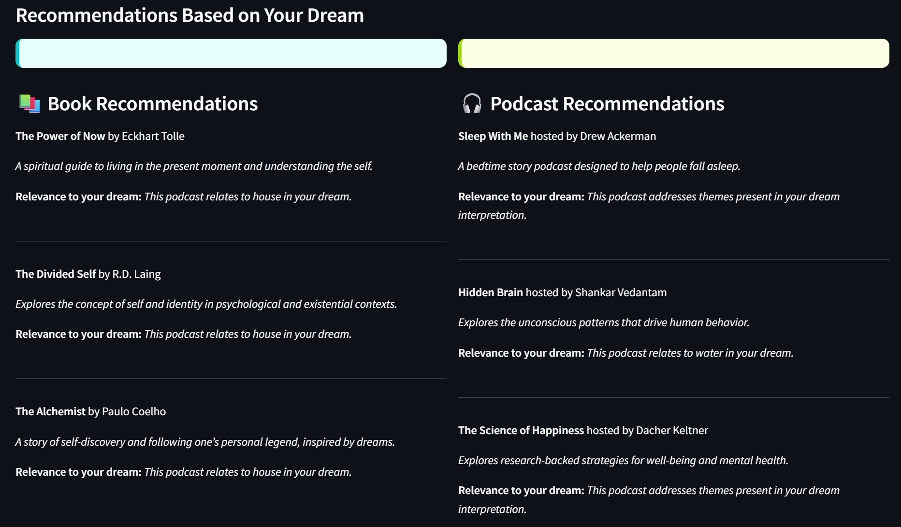

# 🌙 Dream Analyzer

**Unlock the mysteries of your dreams with AI-powered insights.**

Dream Analyzer is a Streamlit-based web application that interprets user-submitted dream narratives using Natural Language Processing (NLP) techniques. By combining psychological, emotional, and cultural analyses, it offers personalized insights into your dreams, complete with visualizations and tailored book or podcast recommendations.

---

## 🚀 Features

- **Emotion Detection**: Uses NRCLex and TextBlob to identify emotions such as joy, fear, anger, and sadness within dream descriptions.
- **Symbol Interpretation**: Analyzes key symbols and themes present in dreams to uncover underlying meanings.
- **Cultural Context Analysis**: Provides interpretations based on cultural references and contexts.
- **Visual Insights**: Generates word clouds and pie charts to visualize prominent themes and emotions.
- **Personalized Recommendations**: Suggests books and podcasts aligned with the emotional and thematic content of the dream.
- **Modular Architecture**: Features a rule-based, explainable system architecture for transparency and ease of understanding.

---

## 🧰 Tech Stack

- **Frontend**: Streamlit
- **Backend**: Python
- **NLP Libraries**: NLTK, TextBlob, NRCLex
- **Data Visualization**: Matplotlib, WordCloud

---

## 📁 Project Structure

```
Dream-Analyzer/
├── assets/                 # Contains images and visual assets
├── data/                   # Includes datasets and CSV files
├── experts/                # Expert rules and knowledge base
├── moegate/                # External modules or integrations
├── preprocessing/          # Scripts for data cleaning and preprocessing
├── dashboard.py            # Streamlit application script
├── main.py                 # Main execution script
├── model.ipynb             # Jupyter notebook for model development
├── requirements.txt        # Python dependencies
└── README.md               # Project documentation
```

---

## 🛠️ Installation

1. **Clone the repository**:

```bash
git clone https://github.com/SudharsaaX/Dream-Analyzer.git
cd Dream-Analyzer
```

2. **Create and activate a virtual environment**:

```bash
python -m venv venv
# On Windows
venv\Scripts\activate
# On Unix or MacOS
source venv/bin/activate
```

3. **Install the required packages**:

```bash
pip install -r requirements.txt
```

---

## 🚀 Usage

1. **Run the Streamlit application**:

```bash
streamlit run dashboard.py
```

2. **Access the application**:

Open your web browser and navigate to `http://localhost:8501/`.

3. **Analyze your dream**:

Enter your dream narrative into the provided text box and submit to receive an analysis.

---

## 📊 Example Output

- **Word Cloud**: Visual representation of the most frequent words in your dream.
- **Emotion Pie Chart**: Distribution of detected emotions within your dream narrative.
- **Recommendations**: Curated list of books and podcasts related to the themes and emotions identified.

---

## 📷 Screenshots (Optional)

> Add these images to `/assets/` and ensure they are named accordingly.

| Word Cloud | Interpretation | Recommendations |
|------------|----------------|------------------|
|  |  |  |

---

## 📚 Data Sources

- **DreamBank Annotated Dataset**: A collection of dream reports used for training and analysis.
- **Expert Rules**: Custom rules and knowledge bases developed for symbol and cultural context interpretation.

---

## 🤝 Contributing

Contributions are welcome! Please follow these steps:

1. **Fork the repository**.
2. **Create a new branch**:

```bash
git checkout -b feature/YourFeature
```

3. **Commit your changes**:

```bash
git commit -m "Add YourFeature"
```

4. **Push to the branch**:

```bash
git push origin feature/YourFeature
```

5. **Open a Pull Request**.

---

## 📄 License

This project is licensed under the MIT License. See the [LICENSE](LICENSE) file for details.

---

## 📞 Contact

For questions or suggestions, please contact [SudharsaaX](https://github.com/SudharsaaX).
